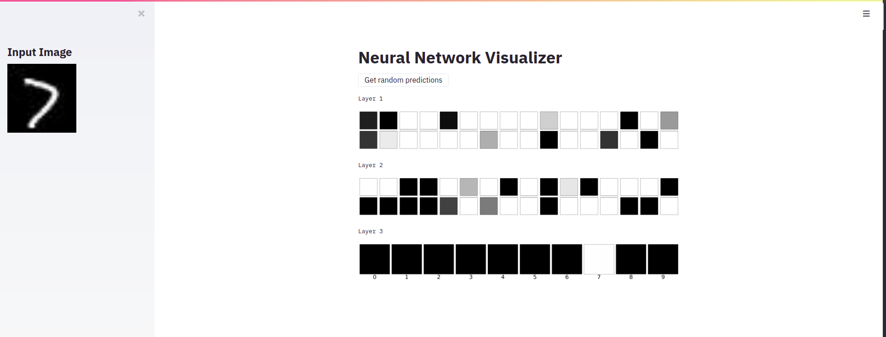

### Neural Network Visualizer

The project consists of a Neural Network Visualizer webapp built using Streamlit, and a simple model server built with Keras and Flask. The Streamlit app visualizes the outputs of all the nodes of all the layers of the neural network for a given input image (handwriiten digit).

On Layer 3 (the output layer), we can see that only the box labelled 7 is white and the rest of the boxes are black. This means the predicted output is 7, which is accurate.

### How to Run?

Create a virualenv:  
`conda create -n myenv python=3.6`

Activate:  
`conda activate myenv`

Install Requirements:  
`pip install -r requirements.txt`

Run:  
`python ml_server.py`

On a different terminal window:  
`streamlit run app.py`

To modify the model, edit the notebook. 